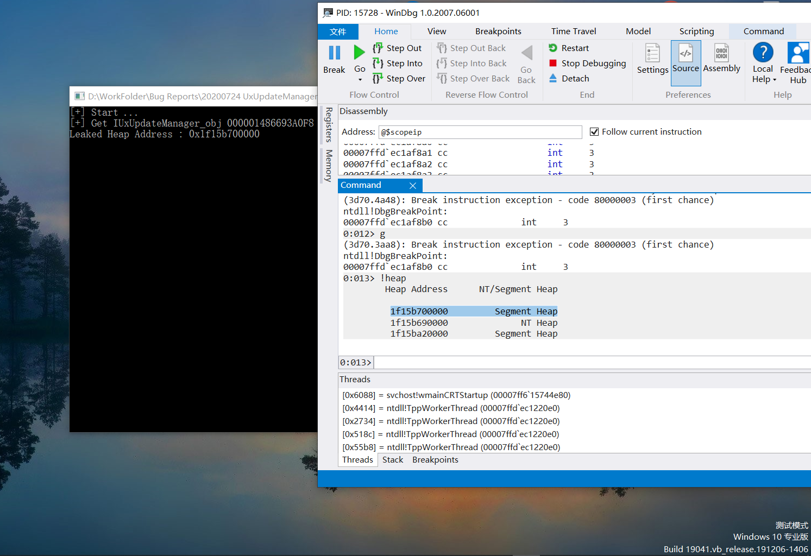

## Introduction

Recently, we reported more than 50 EOP and info leak vulnerabilities to Microsoft. However, many cases closed without conversation, or dirty reasons (e.g.  saying your reports are low quality or medium severity) to refuse to pay bounty. As a security researcher, we know it’s not good option to disclose 0day in public. But when the vendor chooses to ignore your reports, you have no other choice. So, here we publish two very stable info leak vulnerabilities we found last month which Microsoft refuse to fix them.

## Vulnerability 1: Information Leakage in usosvc.dll

A heap address leak bug in `usosvc` service ,  `usosvc.dll!UsoSettingsUtil::GetSetting` leading to Escalation of Privilege.

The root cause of this bug is shown as following code 

```
__int64 __fastcall UsoSettingsUtil::GetSetting(const unsigned __int16 *a1, VARTYPE a2, struct tagVARIANT *a3)
{
	  /*
      	...
      */	
	pvargDest.vt = 8;
    pvargDest.llVal = (LONGLONG)v11;
    v12 = VariantChangeType(&pvargDest, &pvargDest, 0, a2);
    v7 = v12;
    if ( v12 >= 0 )
    {
      v12 = VariantCopy(return_val, &pvargDest);
      /*
      	...
      */
}
```

`a2` is a int value which user can control, the functionality of this code snippet is changing `VARTYPE` of `pvargDest` from `BSTR` to the type you can specify, and then , copy `pvargDest` to `return_val`  and return to the caller. The bug is if caller set `a2 = VT_EMPTY`, once `VariantChangeType` is called , the heap address will be stored into `pvargDest.vt` . Thus attacker can get heap address from `VT` member of the returned`VARIANT`. Once attacker get the heap address, he can bypass ALSR or further exploit other bugs  to finally achieve  `Escalation of Privilege`


To trigger this bug, you should firstly get a `UxUpdateManager` object from `usosvc` and  then call `UxUpdateManager::GetCachedSettingValue`

## POC

1. Compile and run the code I provided. You can get the heap address from `usosvc`
2. To check if the heap address comes from the `usosvc` , you should use windbg attach to `usosvc`, set breakpoint at `VariantChangeType` and focus on the `VT` member of `pvargDest` , check if it's the same with the returned heap address.

## Test Platform
windows 10 2004 19041.450



## Vulnerability 2: Information leakage in usocoreworker.exe

Here is another bug very similar to the former one. It’s reside in `usocoreworker.exe!UsoSettingsUtil::GetSetting`, you can easily modify our former POC to trigger this bug.

## Response from Microsoft
2 weeks after the submission.  We got a response from Microsoft.
“Our engineering team provided this detail in their report: Reproduced, but since it only works in Medium IL this is a Moderate severity and should be addressed as v.Next (no repro on LowIL, AC).”

## Timeline for these 2 information leakage vulnerabilities
* 22 July 2020	: Found and report the bug.
* 12 August 2020	: MSRC replied that “Reproduced, but since it only works in Medium IL this is a Moderate severity and should be addressed as v.Next (no repro on LowIL, AC).”
* 25 August 2020: Published.

## Discussion
Clearly, these kinds of vulnerabilities are very stable information leakage. It breaks the security boundary between medium user and system service. As we can leak the heap address, we can use it to break the ASLR and chain with another memory corruption bug in this service to get a full EOP exploit.  

It is worth mentioning that: we have another memory corruption vulnerability in this server, so we can chain them together to get a full EOP. However, the story of this vulnerability also makes me feel very frustrated with Microsoft. 


## A story of 44 EoP bugs
We report about 44 UAF bugs to Microsoft before August 2020. Microsoft accept these bugs in the beginning. But one day the suddenly refuse to fix these vulnerabilities and saying that “it’s hard for attacker to use them in the real attack scenario, they will only fix them if we can provide additional POC”. 

We reply to Microsoft that we need some time to prepare all the POCs. However, Microsoft directly close all the cases in less than one day without further communication. This seems crazy to us. And we cannot accept that because:
It will take a lot of time to rewrite the POC, if other people report these bugs in this period. We will lost the bounty.
if we report the vulnerability again, some of the bounty awards will change from 20k to 2k because the change the rules.

After 2 weeks arguments (updating our POC and communicate with Microsoft). They finally agreed that our bugs are EOP now. But sadly, they also found an excuse to merge more than half of them. Event they are in different functions, different DLL and different servers.

I guess Microsoft is giving up curing Windows, how stupid I am still hunting Windows Bugs.

## Credits
Zhiniang Peng (@edwardzpeng) & Xuefeng Li 


